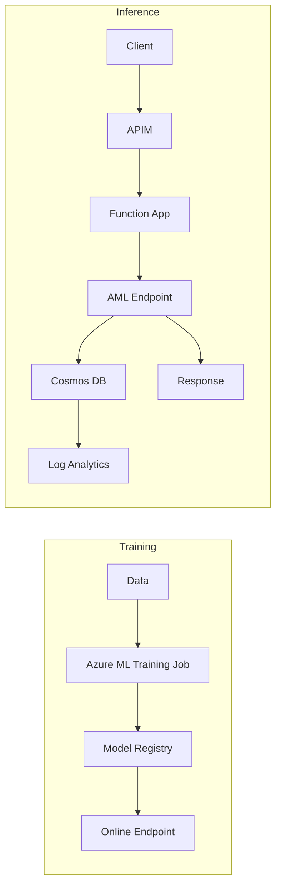

# 📘 **Finetuning-on-Azure (Az-SFT)**

A serverless Generative AI platform on Azure built with Terraform, Azure Machine Learning, Azure Functions, API Management, Cosmos DB, and Blob Storage.
This project enables scalable LLM fine-tuning and inference with enterprise-grade governance, cost efficiency, and unified monitoring.

---

## 🚀 **Overview**

**Az-SFT** is a modular, production-scalable implementation of a fine-tuning and inference pipeline for Large Language Models (LLMs) on Azure.
It is designed to demonstrate:

* Azure ML–based fine-tuning workflows
* Serverless inference (Functions + APIM)
* Token & cost logging using Cosmos DB
* Infrastructure-as-Code using Terraform
* Full observability and governance controls

This repository serves both as a **learning blueprint** and a **deployable GenAI platform foundation** for Azure.

---

## 📂 **Repository Structure**

```text
Az-SFT/
├── README.md                 # Project overview
│
├── app/                      # Inference orchestration (Azure Functions)
│   ├── orchestrator/         # main.py -> handles requests, calls AML endpoint
│   └── utils/                # shared helpers (logging, config, clients)
│
├── ci-cd/                    # Deployment automation
│   ├── ado/                  # Azure DevOps pipelines
│   └── github-actions/       # GitHub Actions workflows
│
├── configs/                  # API schemas & config templates
│   ├── apim/                 # APIM policies (rate limits, auth, transforms)
│   ├── app/                  # Non-secret app configs per environment
│   └── schema/               # Contract definitions (OpenAPI/JSON schema)
│
├── docs/                     # Architecture, design, and operations
│
├── infra/                    # Terraform Infrastructure-as-Code
│   ├── envs/
│   │   └── dev/              # Dev environment root configuration
│   └── modules/              # Reusable Terraform modules
│       ├── apim/             # API Management
│       ├── azureml/          # Azure ML workspace, compute, registry
│       ├── core/             # Resource group, tags, Key Vault, logs
│       ├── cosmosdb/         # Token & cost logging
│       ├── functionapp/      # Serverless function hosting
│       ├── monitor/          # Alerts, dashboards, diagnostic settings
│       ├── networking/       # Optional networks + private endpoints
│       └── storage/          # Blob storage for AML + data
│
└── ml/                       # Machine Learning engineering
    ├── endpoints/
    │   └── scoring/          # Scoring script for AML online endpoints
    ├── model-registry/       # Model metadata & versioning history
    └── training/
        ├── data/             # Training datasets
        ├── notebooks/        # Jupyter experiments
        │   └── experiments.ipynb
        ├── pyproject.toml    # Optional Python project config
        ├── requirements.txt  # ML dependencies
        └── scripts/
            └── training.py    # Fine-tuning & training logic
```
python3 -m venv .venv --prompt "Az-SFT"
---

## 🧩 **High-Level Flow**



---

## 🎯 **Core Capabilities Demonstrated**

### **🔹 ML Engineering**

* LLM fine-tuning using Azure ML jobs & compute
* Notebook-driven experimentation
* Endpoint deployment (online/batch)
* Scoring script architecture

### **🔹 Application Layer**

* Azure Functions as inference orchestrator
* Integration with Azure ML endpoints
* Error handling, request validation, logging

### **🔹 Cloud Architecture**

* Multi-environment Terraform IaC
* Modular resource design
* Secure secret management with Key Vault
* APIM for authentication, throttling, rate limits

### **🔹 FinOps, Governance & Monitoring**

* Token usage logging in Cosmos DB
* Cost attribution per request
* Log Analytics dashboards
* Diagnostic settings + Azure Monitor alerts

---

## 🛠️ **Roadmap**

* [ ] Provision dev infrastructure using Terraform
* [ ] Create Azure ML workspace & compute cluster
* [ ] Run first fine-tuning experiment
* [ ] Deploy online inference endpoint
* [ ] Implement orchestrator Function → AML Endpoint integration
* [ ] Configure Cosmos DB token logging
* [ ] Build APIM layer with policies
* [ ] Enable dashboards & alerts in Log Analytics
* [ ] Extend to UAT and PROD environments

---

## 📜 **MIT License**

```
MIT License

Copyright (c) 2025 

Permission is hereby granted, free of charge, to any person obtaining a copy
of this software and associated documentation files (the "Software"), to deal
in the Software without restriction, including without limitation the rights
to use, copy, modify, merge, publish, distribute, sublicense, and/or sell
copies of the Software, and to permit persons to whom the Software is
furnished to do so, subject to the following conditions:

The above copyright notice and this permission notice shall be included in
all copies or substantial portions of the Software.

THE SOFTWARE IS PROVIDED "AS IS", WITHOUT WARRANTY OF ANY KIND, EXPRESS OR
IMPLIED, INCLUDING BUT NOT LIMITED TO THE WARRANTIES OF MERCHANTABILITY,
FITNESS FOR A PARTICULAR PURPOSE AND NONINFRINGEMENT. IN NO EVENT SHALL THE
AUTHORS OR COPYRIGHT HOLDERS BE LIABLE FOR ANY CLAIM, DAMAGES OR OTHER
LIABILITY, WHETHER IN AN ACTION OF CONTRACT, TORT OR OTHERWISE, ARISING FROM,
OUT OF OR IN CONNECTION WITH THE SOFTWARE OR THE USE OR OTHER DEALINGS IN
THE SOFTWARE.
```